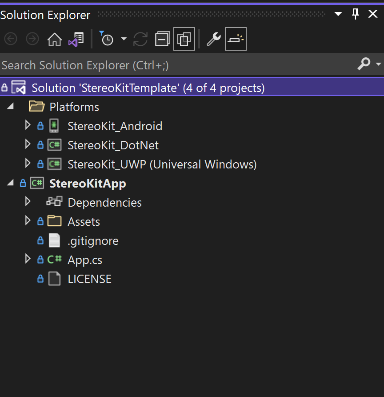

This guide will show you how to add the Meta Quest video passthrough feature to a [StereoKit](https://stereokit.net/) project. This how-to guide is for **Native Android** based StereoKit projects.<!--truncate--> (If you are looking to add passthrough to a .NET Core StereoKit project, check out [this post](/blog/passthrough-dot-net-core) instead.) You can find all the code in this guide over at [this git repo](https://github.com/jackdaus/StereoKitPassthroughNativeAndroid). 

## Prerequisites
- Meta Quest 2
- Visual Studio 2019 or 2022
- Windows 10 or 11
- USB-C cable
- Quest native development environment (https://developer.oculus.com/documentation/native/android/mobile-device-setup/)

## Step 1: Get the code
We’ll start from the ground up with a new StereoKit Project. For this tutorial, we will start with the cross-platform template. First, head over to this GitHub repository and clone it locally to your computer: https://github.com/StereoKit/SKTemplate-Universal. To clone, run this command in a command prompt:

```
git clone https://github.com/StereoKit/SKTemplate-Universal.git
```

Next, fire up Visual Studio (2019 or 2022), click **Open a project or Solution**, and open the file **StereoKitTemplate.sln** that you just cloned. If successful, you should see something like this in the Solution Explorer.



Next, we are going to add the `FBExtension` class to the StereoKitApp project. To do this, right click on **StereoKitApp**, click **Add**, then click **Class**. Create a new file named **PassthroughFBExt.cs**. Then paste this code into your new class file:

<details>
<summary>PassthroughFBExt.cs</summary>

```csharp
using System;
using System.Runtime.InteropServices;

namespace StereoKit.Framework
{
	class PassthroughFBExt : IStepper
	{
		bool extAvailable;
		bool enabled;
		bool enabledPassthrough;
		bool enableOnInitialize;
		bool passthroughRunning;
		XrPassthroughFB      activePassthrough = new XrPassthroughFB();
		XrPassthroughLayerFB activeLayer       = new XrPassthroughLayerFB();

		Color oldColor;
		bool  oldSky;

		public bool Available => extAvailable;
		public bool Enabled { get => extAvailable && enabled; set => enabled = value; }
		public bool EnabledPassthrough { get => enabledPassthrough; set {
			if (Available && enabledPassthrough != value) {
				enabledPassthrough = value;
				if ( enabledPassthrough) StartPassthrough();
				if (!enabledPassthrough) EndPassthrough();
			}
		} }

		public PassthroughFBExt() : this(true) { }
		public PassthroughFBExt(bool enabled = true)
		{
			if (SK.IsInitialized)
				Log.Err("PassthroughFBExt must be constructed before StereoKit is initialized!");
			Backend.OpenXR.RequestExt("XR_FB_passthrough");
			enableOnInitialize = enabled;
		}

		public bool Initialize()
		{
			extAvailable =
				Backend.XRType == BackendXRType.OpenXR &&
				Backend.OpenXR.ExtEnabled("XR_FB_passthrough") &&
				LoadBindings();

			if (enableOnInitialize)
				EnabledPassthrough = true;
			return true;
		}

		public void Step()
		{
			if (!EnabledPassthrough) return;

			XrCompositionLayerPassthroughFB layer = new XrCompositionLayerPassthroughFB(
				XrCompositionLayerFlags.BLEND_TEXTURE_SOURCE_ALPHA_BIT, activeLayer);
			Backend.OpenXR.AddCompositionLayer(layer, -1);
		}

		public void Shutdown()
		{
			EnabledPassthrough = false;
		}

		void StartPassthrough()
		{
			if (!extAvailable) return;
			if (passthroughRunning) return;
			passthroughRunning = true;

			oldColor = Renderer.ClearColor;
			oldSky   = Renderer.EnableSky;

			XrResult result = xrCreatePassthroughFB(
				Backend.OpenXR.Session,
				new XrPassthroughCreateInfoFB(XrPassthroughFlagsFB.IS_RUNNING_AT_CREATION_BIT_FB),
				out activePassthrough);

			result = xrCreatePassthroughLayerFB(
				Backend.OpenXR.Session,
				new XrPassthroughLayerCreateInfoFB(activePassthrough, XrPassthroughFlagsFB.IS_RUNNING_AT_CREATION_BIT_FB, XrPassthroughLayerPurposeFB.RECONSTRUCTION_FB),
				out activeLayer);

			Renderer.ClearColor = Color.BlackTransparent;
			Renderer.EnableSky  = false;
		}

		void EndPassthrough()
		{
			if (!passthroughRunning) return;
			passthroughRunning = false;

			xrPassthroughPauseFB       (activePassthrough);
			xrDestroyPassthroughLayerFB(activeLayer);
			xrDestroyPassthroughFB     (activePassthrough);

			Renderer.ClearColor = oldColor;
			Renderer.EnableSky  = oldSky;
		}

		#region OpenXR native bindings and types
		enum XrStructureType : UInt64
		{
			XR_TYPE_PASSTHROUGH_CREATE_INFO_FB = 1000118001,
			XR_TYPE_PASSTHROUGH_LAYER_CREATE_INFO_FB = 1000118002,
			XR_TYPE_PASSTHROUGH_STYLE_FB = 1000118020,
			XR_TYPE_COMPOSITION_LAYER_PASSTHROUGH_FB = 1000118003,
		}
		enum XrPassthroughFlagsFB : UInt64
		{
			None = 0,
			IS_RUNNING_AT_CREATION_BIT_FB = 0x00000001
		}
		enum XrCompositionLayerFlags : UInt64
		{
			None = 0,
			CORRECT_CHROMATIC_ABERRATION_BIT = 0x00000001,
			BLEND_TEXTURE_SOURCE_ALPHA_BIT = 0x00000002,
			UNPREMULTIPLIED_ALPHA_BIT = 0x00000004,
		}
		enum XrPassthroughLayerPurposeFB : UInt32
		{
			RECONSTRUCTION_FB = 0,
			PROJECTED_FB = 1,
			TRACKED_KEYBOARD_HANDS_FB = 1000203001,
			MAX_ENUM_FB = 0x7FFFFFFF,
		}
		enum XrResult : UInt32
		{
			Success = 0,
		}

#pragma warning disable 0169 // handle is not "used", but required for interop
		struct XrPassthroughFB      { ulong handle; }
		struct XrPassthroughLayerFB { ulong handle; }
#pragma warning restore 0169

		[StructLayout(LayoutKind.Sequential)]
		struct XrPassthroughCreateInfoFB
		{
			private XrStructureType             type;
			public  IntPtr                      next;
			public  XrPassthroughFlagsFB        flags;

			public XrPassthroughCreateInfoFB(XrPassthroughFlagsFB passthroughFlags)
			{
				type  = XrStructureType.XR_TYPE_PASSTHROUGH_CREATE_INFO_FB;
				next  = IntPtr.Zero;
				flags = passthroughFlags;
			}
		}
		[StructLayout(LayoutKind.Sequential)]
		struct XrPassthroughLayerCreateInfoFB
		{
			private XrStructureType             type;
			public  IntPtr                      next;
			public  XrPassthroughFB             passthrough;
			public  XrPassthroughFlagsFB        flags;
			public  XrPassthroughLayerPurposeFB purpose;

			public XrPassthroughLayerCreateInfoFB(XrPassthroughFB passthrough, XrPassthroughFlagsFB flags, XrPassthroughLayerPurposeFB purpose)
			{
				type  = XrStructureType.XR_TYPE_PASSTHROUGH_LAYER_CREATE_INFO_FB;
				next  = IntPtr.Zero;
				this.passthrough = passthrough;
				this.flags       = flags;
				this.purpose     = purpose;
			}
		}
		[StructLayout(LayoutKind.Sequential)]
		struct XrPassthroughStyleFB
		{
			public XrStructureType             type;
			public IntPtr                      next;
			public float                       textureOpacityFactor;
			public Color                       edgeColor;
			public XrPassthroughStyleFB(float textureOpacityFactor, Color edgeColor)
			{
				type = XrStructureType.XR_TYPE_PASSTHROUGH_STYLE_FB;
				next = IntPtr.Zero;
				this.textureOpacityFactor = textureOpacityFactor;
				this.edgeColor            = edgeColor;
			}
		}
		[StructLayout(LayoutKind.Sequential)]
		struct XrCompositionLayerPassthroughFB
		{
			public XrStructureType             type;
			public IntPtr                      next;
			public XrCompositionLayerFlags     flags;
			public ulong                       space;
			public XrPassthroughLayerFB        layerHandle;
			public XrCompositionLayerPassthroughFB(XrCompositionLayerFlags flags, XrPassthroughLayerFB layerHandle)
			{
				type = XrStructureType.XR_TYPE_COMPOSITION_LAYER_PASSTHROUGH_FB;
				next = IntPtr.Zero;
				space = 0;
				this.flags = flags;
				this.layerHandle = layerHandle;
			}
		}

		delegate XrResult del_xrCreatePassthroughFB       (ulong session, [In] XrPassthroughCreateInfoFB createInfo, out XrPassthroughFB outPassthrough);
		delegate XrResult del_xrDestroyPassthroughFB      (XrPassthroughFB passthrough);
		delegate XrResult del_xrPassthroughStartFB        (XrPassthroughFB passthrough);
		delegate XrResult del_xrPassthroughPauseFB        (XrPassthroughFB passthrough);
		delegate XrResult del_xrCreatePassthroughLayerFB  (ulong session, [In] XrPassthroughLayerCreateInfoFB createInfo, out XrPassthroughLayerFB outLayer);
		delegate XrResult del_xrDestroyPassthroughLayerFB (XrPassthroughLayerFB layer);
		delegate XrResult del_xrPassthroughLayerPauseFB   (XrPassthroughLayerFB layer);
		delegate XrResult del_xrPassthroughLayerResumeFB  (XrPassthroughLayerFB layer);
		delegate XrResult del_xrPassthroughLayerSetStyleFB(XrPassthroughLayerFB layer, [In] XrPassthroughStyleFB style);

		del_xrCreatePassthroughFB        xrCreatePassthroughFB;
		del_xrDestroyPassthroughFB       xrDestroyPassthroughFB;
		del_xrPassthroughStartFB         xrPassthroughStartFB;
		del_xrPassthroughPauseFB         xrPassthroughPauseFB;
		del_xrCreatePassthroughLayerFB   xrCreatePassthroughLayerFB;
		del_xrDestroyPassthroughLayerFB  xrDestroyPassthroughLayerFB;
		del_xrPassthroughLayerPauseFB    xrPassthroughLayerPauseFB;
		del_xrPassthroughLayerResumeFB   xrPassthroughLayerResumeFB;
		del_xrPassthroughLayerSetStyleFB xrPassthroughLayerSetStyleFB;

		bool LoadBindings()
		{
			xrCreatePassthroughFB        = Backend.OpenXR.GetFunction<del_xrCreatePassthroughFB>       ("xrCreatePassthroughFB");
			xrDestroyPassthroughFB       = Backend.OpenXR.GetFunction<del_xrDestroyPassthroughFB>      ("xrDestroyPassthroughFB");
			xrPassthroughStartFB         = Backend.OpenXR.GetFunction<del_xrPassthroughStartFB>        ("xrPassthroughStartFB");
			xrPassthroughPauseFB         = Backend.OpenXR.GetFunction<del_xrPassthroughPauseFB>        ("xrPassthroughPauseFB");
			xrCreatePassthroughLayerFB   = Backend.OpenXR.GetFunction<del_xrCreatePassthroughLayerFB>  ("xrCreatePassthroughLayerFB");
			xrDestroyPassthroughLayerFB  = Backend.OpenXR.GetFunction<del_xrDestroyPassthroughLayerFB> ("xrDestroyPassthroughLayerFB");
			xrPassthroughLayerPauseFB    = Backend.OpenXR.GetFunction<del_xrPassthroughLayerPauseFB>   ("xrPassthroughLayerPauseFB");
			xrPassthroughLayerResumeFB   = Backend.OpenXR.GetFunction<del_xrPassthroughLayerResumeFB>  ("xrPassthroughLayerResumeFB");
			xrPassthroughLayerSetStyleFB = Backend.OpenXR.GetFunction<del_xrPassthroughLayerSetStyleFB>("xrPassthroughLayerSetStyleFB");

			return
				xrCreatePassthroughFB        != null &&
				xrDestroyPassthroughFB       != null &&
				xrPassthroughStartFB         != null &&
				xrPassthroughPauseFB         != null &&
				xrCreatePassthroughLayerFB   != null &&
				xrDestroyPassthroughLayerFB  != null &&
				xrPassthroughLayerPauseFB    != null &&
				xrPassthroughLayerResumeFB   != null &&
				xrPassthroughLayerSetStyleFB != null;
		}
		#endregion
	}
}

```
For the latest version of this code, check out the source at: 

https://github.com/StereoKit/StereoKit/blob/master/Examples/StereoKitTest/Tools/PassthroughFBExt.cs 
</details>

Now we are going to tweak this code a bit to get it to fit nicely into the cross-platform app. Make the class public by adding the keyword `public` in line 6.


<details>
<summary>PassthroughFBExt.cs</summary>

```csharp showLineNumbers
using System;
using System.Runtime.InteropServices;

namespace StereoKit.Framework
{
    // highlight-next-line
	public class PassthroughFBExt : IStepper
	{
		bool extAvailable;
		bool enabled;
		bool enabledPassthrough;
		bool enableOnInitialize;
		bool passthroughRunning;
		XrPassthroughFB      activePassthrough = new XrPassthroughFB();
		XrPassthroughLayerFB activeLayer       = new XrPassthroughLayerFB();

		Color oldColor;
		bool  oldSky;

		public bool Available => extAvailable;
		public bool Enabled { get => extAvailable && enabled; set => enabled = value; }
		public bool EnabledPassthrough { get => enabledPassthrough; set {
			if (Available && enabledPassthrough != value) {
				enabledPassthrough = value;
				if ( enabledPassthrough) StartPassthrough();
				if (!enabledPassthrough) EndPassthrough();
			}
		} }

		public PassthroughFBExt() : this(true) { }
		public PassthroughFBExt(bool enabled = true)
		{
			if (SK.IsInitialized)
				Log.Err("PassthroughFBExt must be constructed before StereoKit is initialized!");
			Backend.OpenXR.RequestExt("XR_FB_passthrough");
			enableOnInitialize = enabled;
		}

		public bool Initialize()
		{
			extAvailable =
				Backend.XRType == BackendXRType.OpenXR &&
				Backend.OpenXR.ExtEnabled("XR_FB_passthrough") &&
				LoadBindings();

			if (enableOnInitialize)
				EnabledPassthrough = true;
			return true;
		}

		public void Step()
		{
			if (!EnabledPassthrough) return;

			XrCompositionLayerPassthroughFB layer = new XrCompositionLayerPassthroughFB(
				XrCompositionLayerFlags.BLEND_TEXTURE_SOURCE_ALPHA_BIT, activeLayer);
			Backend.OpenXR.AddCompositionLayer(layer, -1);
		}

		public void Shutdown()
		{
			EnabledPassthrough = false;
		}

		void StartPassthrough()
		{
			if (!extAvailable) return;
			if (passthroughRunning) return;
			passthroughRunning = true;

			oldColor = Renderer.ClearColor;
			oldSky   = Renderer.EnableSky;

			XrResult result = xrCreatePassthroughFB(
				Backend.OpenXR.Session,
				new XrPassthroughCreateInfoFB(XrPassthroughFlagsFB.IS_RUNNING_AT_CREATION_BIT_FB),
				out activePassthrough);

			result = xrCreatePassthroughLayerFB(
				Backend.OpenXR.Session,
				new XrPassthroughLayerCreateInfoFB(activePassthrough, XrPassthroughFlagsFB.IS_RUNNING_AT_CREATION_BIT_FB, XrPassthroughLayerPurposeFB.RECONSTRUCTION_FB),
				out activeLayer);

			Renderer.ClearColor = Color.BlackTransparent;
			Renderer.EnableSky  = false;
		}

		void EndPassthrough()
		{
			if (!passthroughRunning) return;
			passthroughRunning = false;

			xrPassthroughPauseFB       (activePassthrough);
			xrDestroyPassthroughLayerFB(activeLayer);
			xrDestroyPassthroughFB     (activePassthrough);

			Renderer.ClearColor = oldColor;
			Renderer.EnableSky  = oldSky;
		}

		#region OpenXR native bindings and types
		enum XrStructureType : UInt64
		{
			XR_TYPE_PASSTHROUGH_CREATE_INFO_FB = 1000118001,
			XR_TYPE_PASSTHROUGH_LAYER_CREATE_INFO_FB = 1000118002,
			XR_TYPE_PASSTHROUGH_STYLE_FB = 1000118020,
			XR_TYPE_COMPOSITION_LAYER_PASSTHROUGH_FB = 1000118003,
		}
		enum XrPassthroughFlagsFB : UInt64
		{
			None = 0,
			IS_RUNNING_AT_CREATION_BIT_FB = 0x00000001
		}
		enum XrCompositionLayerFlags : UInt64
		{
			None = 0,
			CORRECT_CHROMATIC_ABERRATION_BIT = 0x00000001,
			BLEND_TEXTURE_SOURCE_ALPHA_BIT = 0x00000002,
			UNPREMULTIPLIED_ALPHA_BIT = 0x00000004,
		}
		enum XrPassthroughLayerPurposeFB : UInt32
		{
			RECONSTRUCTION_FB = 0,
			PROJECTED_FB = 1,
			TRACKED_KEYBOARD_HANDS_FB = 1000203001,
			MAX_ENUM_FB = 0x7FFFFFFF,
		}
		enum XrResult : UInt32
		{
			Success = 0,
		}

#pragma warning disable 0169 // handle is not "used", but required for interop
		struct XrPassthroughFB      { ulong handle; }
		struct XrPassthroughLayerFB { ulong handle; }
#pragma warning restore 0169

		[StructLayout(LayoutKind.Sequential)]
		struct XrPassthroughCreateInfoFB
		{
			private XrStructureType             type;
			public  IntPtr                      next;
			public  XrPassthroughFlagsFB        flags;

			public XrPassthroughCreateInfoFB(XrPassthroughFlagsFB passthroughFlags)
			{
				type  = XrStructureType.XR_TYPE_PASSTHROUGH_CREATE_INFO_FB;
				next  = IntPtr.Zero;
				flags = passthroughFlags;
			}
		}
		[StructLayout(LayoutKind.Sequential)]
		struct XrPassthroughLayerCreateInfoFB
		{
			private XrStructureType             type;
			public  IntPtr                      next;
			public  XrPassthroughFB             passthrough;
			public  XrPassthroughFlagsFB        flags;
			public  XrPassthroughLayerPurposeFB purpose;

			public XrPassthroughLayerCreateInfoFB(XrPassthroughFB passthrough, XrPassthroughFlagsFB flags, XrPassthroughLayerPurposeFB purpose)
			{
				type  = XrStructureType.XR_TYPE_PASSTHROUGH_LAYER_CREATE_INFO_FB;
				next  = IntPtr.Zero;
				this.passthrough = passthrough;
				this.flags       = flags;
				this.purpose     = purpose;
			}
		}
		[StructLayout(LayoutKind.Sequential)]
		struct XrPassthroughStyleFB
		{
			public XrStructureType             type;
			public IntPtr                      next;
			public float                       textureOpacityFactor;
			public Color                       edgeColor;
			public XrPassthroughStyleFB(float textureOpacityFactor, Color edgeColor)
			{
				type = XrStructureType.XR_TYPE_PASSTHROUGH_STYLE_FB;
				next = IntPtr.Zero;
				this.textureOpacityFactor = textureOpacityFactor;
				this.edgeColor            = edgeColor;
			}
		}
		[StructLayout(LayoutKind.Sequential)]
		struct XrCompositionLayerPassthroughFB
		{
			public XrStructureType             type;
			public IntPtr                      next;
			public XrCompositionLayerFlags     flags;
			public ulong                       space;
			public XrPassthroughLayerFB        layerHandle;
			public XrCompositionLayerPassthroughFB(XrCompositionLayerFlags flags, XrPassthroughLayerFB layerHandle)
			{
				type = XrStructureType.XR_TYPE_COMPOSITION_LAYER_PASSTHROUGH_FB;
				next = IntPtr.Zero;
				space = 0;
				this.flags = flags;
				this.layerHandle = layerHandle;
			}
		}

		delegate XrResult del_xrCreatePassthroughFB       (ulong session, [In] XrPassthroughCreateInfoFB createInfo, out XrPassthroughFB outPassthrough);
		delegate XrResult del_xrDestroyPassthroughFB      (XrPassthroughFB passthrough);
		delegate XrResult del_xrPassthroughStartFB        (XrPassthroughFB passthrough);
		delegate XrResult del_xrPassthroughPauseFB        (XrPassthroughFB passthrough);
		delegate XrResult del_xrCreatePassthroughLayerFB  (ulong session, [In] XrPassthroughLayerCreateInfoFB createInfo, out XrPassthroughLayerFB outLayer);
		delegate XrResult del_xrDestroyPassthroughLayerFB (XrPassthroughLayerFB layer);
		delegate XrResult del_xrPassthroughLayerPauseFB   (XrPassthroughLayerFB layer);
		delegate XrResult del_xrPassthroughLayerResumeFB  (XrPassthroughLayerFB layer);
		delegate XrResult del_xrPassthroughLayerSetStyleFB(XrPassthroughLayerFB layer, [In] XrPassthroughStyleFB style);

		del_xrCreatePassthroughFB        xrCreatePassthroughFB;
		del_xrDestroyPassthroughFB       xrDestroyPassthroughFB;
		del_xrPassthroughStartFB         xrPassthroughStartFB;
		del_xrPassthroughPauseFB         xrPassthroughPauseFB;
		del_xrCreatePassthroughLayerFB   xrCreatePassthroughLayerFB;
		del_xrDestroyPassthroughLayerFB  xrDestroyPassthroughLayerFB;
		del_xrPassthroughLayerPauseFB    xrPassthroughLayerPauseFB;
		del_xrPassthroughLayerResumeFB   xrPassthroughLayerResumeFB;
		del_xrPassthroughLayerSetStyleFB xrPassthroughLayerSetStyleFB;

		bool LoadBindings()
		{
			xrCreatePassthroughFB        = Backend.OpenXR.GetFunction<del_xrCreatePassthroughFB>       ("xrCreatePassthroughFB");
			xrDestroyPassthroughFB       = Backend.OpenXR.GetFunction<del_xrDestroyPassthroughFB>      ("xrDestroyPassthroughFB");
			xrPassthroughStartFB         = Backend.OpenXR.GetFunction<del_xrPassthroughStartFB>        ("xrPassthroughStartFB");
			xrPassthroughPauseFB         = Backend.OpenXR.GetFunction<del_xrPassthroughPauseFB>        ("xrPassthroughPauseFB");
			xrCreatePassthroughLayerFB   = Backend.OpenXR.GetFunction<del_xrCreatePassthroughLayerFB>  ("xrCreatePassthroughLayerFB");
			xrDestroyPassthroughLayerFB  = Backend.OpenXR.GetFunction<del_xrDestroyPassthroughLayerFB> ("xrDestroyPassthroughLayerFB");
			xrPassthroughLayerPauseFB    = Backend.OpenXR.GetFunction<del_xrPassthroughLayerPauseFB>   ("xrPassthroughLayerPauseFB");
			xrPassthroughLayerResumeFB   = Backend.OpenXR.GetFunction<del_xrPassthroughLayerResumeFB>  ("xrPassthroughLayerResumeFB");
			xrPassthroughLayerSetStyleFB = Backend.OpenXR.GetFunction<del_xrPassthroughLayerSetStyleFB>("xrPassthroughLayerSetStyleFB");

			return
				xrCreatePassthroughFB        != null &&
				xrDestroyPassthroughFB       != null &&
				xrPassthroughStartFB         != null &&
				xrPassthroughPauseFB         != null &&
				xrCreatePassthroughLayerFB   != null &&
				xrDestroyPassthroughLayerFB  != null &&
				xrPassthroughLayerPauseFB    != null &&
				xrPassthroughLayerResumeFB   != null &&
				xrPassthroughLayerSetStyleFB != null;
		}
		#endregion
	}
}

```
</details>

## Step 2: Initialize the PassthroughFBExt stepper
Next, we’ll define an instance of the `PassthroughFBExt` in our App.cs file. We’ll define it in App.cs so that it will be conveniently available across the app. In the **StereoKitApp/App.cs** file, declare a public `PassthroughFBExt` field (line 14). Add the `using StereoKit.Framework` statement at the top of the file (line 2):

```csharp title="StereoKitApp/App.cs" showLineNumbers
using StereoKit;
// highlight-next-line
using StereoKit.Framework;

namespace StereoKitApp
{
	public class App
	{
		public SKSettings Settings => new SKSettings {
			appName           = "StereoKit Template",
			assetsFolder      = "Assets",
			displayPreference = DisplayMode.MixedReality
		};

        // highlight-next-line
		public static PassthroughFBExt Passthrough;

		Pose  cubePose = new Pose(0, 0, -0.5f, Quat.Identity);
		Model cube;
		Matrix   floorTransform = Matrix.TS(new Vec3(0, -1.5f, 0), new Vec3(30, 0.1f, 30));
		Material floorMaterial;

		public void Init()
		{
			// Create assets used by the app
			cube = Model.FromMesh(
				Mesh.GenerateRoundedCube(Vec3.One * 0.1f, 0.02f),
				Default.MaterialUI);

			floorMaterial = new Material(Shader.FromFile("floor.hlsl"));
			floorMaterial.Transparency = Transparency.Blend;
		}

		public void Step()
		{
			if (SK.System.displayType == Display.Opaque)
				Default.MeshCube.Draw(floorMaterial, floorTransform);

			UI.Handle("Cube", ref cubePose, cube.Bounds);
			cube.Draw(cubePose.ToMatrix());
		}
	}
}
```

Now we need to initialize this `PassthroughFBExt` object. To do that, head over to file **Platforms/StereoKit_Android/MainActivity.cs**. In the `Task.Run` method, we will initialize the object before StereoKit it initialized. Then, after StereoKit is initialized, we turn on the passthrough!

```csharp title="Platforms/StereoKit_Android/MainActivity.cs"
Task.Run(() => {
		// If the app has a constructor that takes a string array, then
		// we'll use that, and pass the command line arguments into it on
		// creation
		Type appType = typeof(App);
		app = appType.GetConstructor(new Type[] { typeof(string[]) }) != null
			? (App)Activator.CreateInstance(appType, new object[] { new string[0] { } })
			: (App)Activator.CreateInstance(appType);
		if (app == null)
			throw new System.Exception("StereoKit loader couldn't construct an instance of the App!");

        // highlight-start
		// Create passthrough stepper here. MUST be done before call to SK.Initialize
		App.Passthrough = SK.AddStepper(new PassthroughFBExt());
        // highlight-end

		// Initialize StereoKit, and the app
		SKSettings settings = app.Settings;
		settings.androidActivity = activityHandle;
		if (!SK.Initialize(settings))
			return;
		app.Init();

        // highlight-start
		// Turn on the passthrough!
		App.Passthrough.EnabledPassthrough = true;
        // highlight-end
        
		// Now loop until finished, and then shut down
		SK.Run(app.Step);

		Android.OS.Process.KillProcess(Android.OS.Process.MyPid());
	});
} 
```

## Step 3: Tweak Android Manifest
In order for our Android app to use the passthrough, we’ll need to add the feature to the android manifest. Head over to **Platforms/StereoKit_Android/Properties/AndroidManifest.xml**. Add this line of code to the manifest:
```xml
<uses-feature android:name="com.oculus.feature.PASSTHROUGH" android:required="true" />
```

## Step 4: Run it!
In the Solution Explorer, right click on **StereoKit_Android** and select **Set as Startup Project**. Plug in your Quest to your computer using a USB-C cable. Click Play!


## Summary
To access all the code files used in this guide, check out this git repo here: https://github.com/jackdaus/StereoKitPassthroughNativeAndroid. You can clone this repository and run the completed project on your Quest!