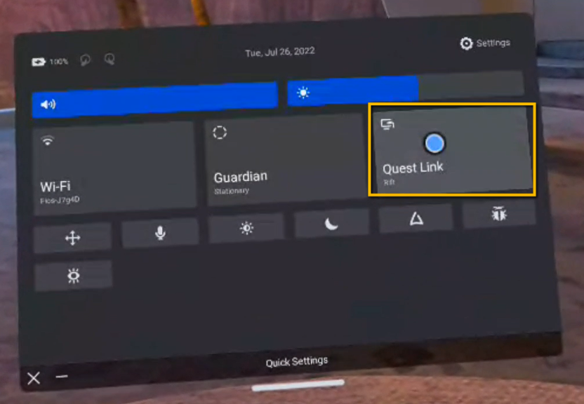

This guide will show you how to add the Meta Quest video passthrough feature to a [StereoKit](https://stereokit.net/) project. This how-to guide is for **.NET Core** based StereoKit projects.<!--truncate-->(If you’re looking to enable passthrough on a Native Android StereoKit project, check out [this post](/blog/passthrough-native-android) instead!) You can find all the code in this guide over at [this git repo](https://github.com/jackdaus/StereoKitPassthroughDotNet). 

## Prerequisites
- Meta Quest 2
- Visual Studio 2019 or 2022
- Windows 10 or 11
- Quest Link (or Quest Air Link)

## Step 1: Create a new StereoKit project
We will start from scratch by creating a new StereoKit project. The easiest way to get up and running with a fresh StereoKit project is to use a Visual Studio template! If you don’t already have the StereoKit Visual Studio templates, head over to this link to download and install them: https://marketplace.visualstudio.com/items?itemName=NickKlingensmith.StereoKitTemplates

Now open up Visual Studio (2019 or 2022). Click on **Create a new project**. Search for “StereoKit” and select **StereoKit .Net Core**. Give your project a name and create it.


## Step 2: Get the passthrough code
Next, we need to add the code for the passthrough extension. To do this, right click on your project name in the Solution Explorer, click **Add**, then click **Class**. Create a new file named **PassthroughFBExt.cs**. Then paste this code into your new class file:

<details>
<summary>PassthroughFBExt.cs</summary>

```csharp
using System;
using System.Runtime.InteropServices;

namespace StereoKit.Framework
{
	class PassthroughFBExt : IStepper
	{
		bool extAvailable;
		bool enabled;
		bool enabledPassthrough;
		bool enableOnInitialize;
		bool passthroughRunning;
		XrPassthroughFB      activePassthrough = new XrPassthroughFB();
		XrPassthroughLayerFB activeLayer       = new XrPassthroughLayerFB();

		Color oldColor;
		bool  oldSky;

		public bool Available => extAvailable;
		public bool Enabled { get => extAvailable && enabled; set => enabled = value; }
		public bool EnabledPassthrough { get => enabledPassthrough; set {
			if (Available && enabledPassthrough != value) {
				enabledPassthrough = value;
				if ( enabledPassthrough) StartPassthrough();
				if (!enabledPassthrough) EndPassthrough();
			}
		} }

		public PassthroughFBExt() : this(true) { }
		public PassthroughFBExt(bool enabled = true)
		{
			if (SK.IsInitialized)
				Log.Err("PassthroughFBExt must be constructed before StereoKit is initialized!");
			Backend.OpenXR.RequestExt("XR_FB_passthrough");
			enableOnInitialize = enabled;
		}

		public bool Initialize()
		{
			extAvailable =
				Backend.XRType == BackendXRType.OpenXR &&
				Backend.OpenXR.ExtEnabled("XR_FB_passthrough") &&
				LoadBindings();

			if (enableOnInitialize)
				EnabledPassthrough = true;
			return true;
		}

		public void Step()
		{
			if (!EnabledPassthrough) return;

			XrCompositionLayerPassthroughFB layer = new XrCompositionLayerPassthroughFB(
				XrCompositionLayerFlags.BLEND_TEXTURE_SOURCE_ALPHA_BIT, activeLayer);
			Backend.OpenXR.AddCompositionLayer(layer, -1);
		}

		public void Shutdown()
		{
			EnabledPassthrough = false;
		}

		void StartPassthrough()
		{
			if (!extAvailable) return;
			if (passthroughRunning) return;
			passthroughRunning = true;

			oldColor = Renderer.ClearColor;
			oldSky   = Renderer.EnableSky;

			XrResult result = xrCreatePassthroughFB(
				Backend.OpenXR.Session,
				new XrPassthroughCreateInfoFB(XrPassthroughFlagsFB.IS_RUNNING_AT_CREATION_BIT_FB),
				out activePassthrough);

			result = xrCreatePassthroughLayerFB(
				Backend.OpenXR.Session,
				new XrPassthroughLayerCreateInfoFB(activePassthrough, XrPassthroughFlagsFB.IS_RUNNING_AT_CREATION_BIT_FB, XrPassthroughLayerPurposeFB.RECONSTRUCTION_FB),
				out activeLayer);

			Renderer.ClearColor = Color.BlackTransparent;
			Renderer.EnableSky  = false;
		}

		void EndPassthrough()
		{
			if (!passthroughRunning) return;
			passthroughRunning = false;

			xrPassthroughPauseFB       (activePassthrough);
			xrDestroyPassthroughLayerFB(activeLayer);
			xrDestroyPassthroughFB     (activePassthrough);

			Renderer.ClearColor = oldColor;
			Renderer.EnableSky  = oldSky;
		}

		#region OpenXR native bindings and types
		enum XrStructureType : UInt64
		{
			XR_TYPE_PASSTHROUGH_CREATE_INFO_FB = 1000118001,
			XR_TYPE_PASSTHROUGH_LAYER_CREATE_INFO_FB = 1000118002,
			XR_TYPE_PASSTHROUGH_STYLE_FB = 1000118020,
			XR_TYPE_COMPOSITION_LAYER_PASSTHROUGH_FB = 1000118003,
		}
		enum XrPassthroughFlagsFB : UInt64
		{
			None = 0,
			IS_RUNNING_AT_CREATION_BIT_FB = 0x00000001
		}
		enum XrCompositionLayerFlags : UInt64
		{
			None = 0,
			CORRECT_CHROMATIC_ABERRATION_BIT = 0x00000001,
			BLEND_TEXTURE_SOURCE_ALPHA_BIT = 0x00000002,
			UNPREMULTIPLIED_ALPHA_BIT = 0x00000004,
		}
		enum XrPassthroughLayerPurposeFB : UInt32
		{
			RECONSTRUCTION_FB = 0,
			PROJECTED_FB = 1,
			TRACKED_KEYBOARD_HANDS_FB = 1000203001,
			MAX_ENUM_FB = 0x7FFFFFFF,
		}
		enum XrResult : UInt32
		{
			Success = 0,
		}

#pragma warning disable 0169 // handle is not "used", but required for interop
		struct XrPassthroughFB      { ulong handle; }
		struct XrPassthroughLayerFB { ulong handle; }
#pragma warning restore 0169

		[StructLayout(LayoutKind.Sequential)]
		struct XrPassthroughCreateInfoFB
		{
			private XrStructureType             type;
			public  IntPtr                      next;
			public  XrPassthroughFlagsFB        flags;

			public XrPassthroughCreateInfoFB(XrPassthroughFlagsFB passthroughFlags)
			{
				type  = XrStructureType.XR_TYPE_PASSTHROUGH_CREATE_INFO_FB;
				next  = IntPtr.Zero;
				flags = passthroughFlags;
			}
		}
		[StructLayout(LayoutKind.Sequential)]
		struct XrPassthroughLayerCreateInfoFB
		{
			private XrStructureType             type;
			public  IntPtr                      next;
			public  XrPassthroughFB             passthrough;
			public  XrPassthroughFlagsFB        flags;
			public  XrPassthroughLayerPurposeFB purpose;

			public XrPassthroughLayerCreateInfoFB(XrPassthroughFB passthrough, XrPassthroughFlagsFB flags, XrPassthroughLayerPurposeFB purpose)
			{
				type  = XrStructureType.XR_TYPE_PASSTHROUGH_LAYER_CREATE_INFO_FB;
				next  = IntPtr.Zero;
				this.passthrough = passthrough;
				this.flags       = flags;
				this.purpose     = purpose;
			}
		}
		[StructLayout(LayoutKind.Sequential)]
		struct XrPassthroughStyleFB
		{
			public XrStructureType             type;
			public IntPtr                      next;
			public float                       textureOpacityFactor;
			public Color                       edgeColor;
			public XrPassthroughStyleFB(float textureOpacityFactor, Color edgeColor)
			{
				type = XrStructureType.XR_TYPE_PASSTHROUGH_STYLE_FB;
				next = IntPtr.Zero;
				this.textureOpacityFactor = textureOpacityFactor;
				this.edgeColor            = edgeColor;
			}
		}
		[StructLayout(LayoutKind.Sequential)]
		struct XrCompositionLayerPassthroughFB
		{
			public XrStructureType             type;
			public IntPtr                      next;
			public XrCompositionLayerFlags     flags;
			public ulong                       space;
			public XrPassthroughLayerFB        layerHandle;
			public XrCompositionLayerPassthroughFB(XrCompositionLayerFlags flags, XrPassthroughLayerFB layerHandle)
			{
				type = XrStructureType.XR_TYPE_COMPOSITION_LAYER_PASSTHROUGH_FB;
				next = IntPtr.Zero;
				space = 0;
				this.flags = flags;
				this.layerHandle = layerHandle;
			}
		}

		delegate XrResult del_xrCreatePassthroughFB       (ulong session, [In] XrPassthroughCreateInfoFB createInfo, out XrPassthroughFB outPassthrough);
		delegate XrResult del_xrDestroyPassthroughFB      (XrPassthroughFB passthrough);
		delegate XrResult del_xrPassthroughStartFB        (XrPassthroughFB passthrough);
		delegate XrResult del_xrPassthroughPauseFB        (XrPassthroughFB passthrough);
		delegate XrResult del_xrCreatePassthroughLayerFB  (ulong session, [In] XrPassthroughLayerCreateInfoFB createInfo, out XrPassthroughLayerFB outLayer);
		delegate XrResult del_xrDestroyPassthroughLayerFB (XrPassthroughLayerFB layer);
		delegate XrResult del_xrPassthroughLayerPauseFB   (XrPassthroughLayerFB layer);
		delegate XrResult del_xrPassthroughLayerResumeFB  (XrPassthroughLayerFB layer);
		delegate XrResult del_xrPassthroughLayerSetStyleFB(XrPassthroughLayerFB layer, [In] XrPassthroughStyleFB style);

		del_xrCreatePassthroughFB        xrCreatePassthroughFB;
		del_xrDestroyPassthroughFB       xrDestroyPassthroughFB;
		del_xrPassthroughStartFB         xrPassthroughStartFB;
		del_xrPassthroughPauseFB         xrPassthroughPauseFB;
		del_xrCreatePassthroughLayerFB   xrCreatePassthroughLayerFB;
		del_xrDestroyPassthroughLayerFB  xrDestroyPassthroughLayerFB;
		del_xrPassthroughLayerPauseFB    xrPassthroughLayerPauseFB;
		del_xrPassthroughLayerResumeFB   xrPassthroughLayerResumeFB;
		del_xrPassthroughLayerSetStyleFB xrPassthroughLayerSetStyleFB;

		bool LoadBindings()
		{
			xrCreatePassthroughFB        = Backend.OpenXR.GetFunction<del_xrCreatePassthroughFB>       ("xrCreatePassthroughFB");
			xrDestroyPassthroughFB       = Backend.OpenXR.GetFunction<del_xrDestroyPassthroughFB>      ("xrDestroyPassthroughFB");
			xrPassthroughStartFB         = Backend.OpenXR.GetFunction<del_xrPassthroughStartFB>        ("xrPassthroughStartFB");
			xrPassthroughPauseFB         = Backend.OpenXR.GetFunction<del_xrPassthroughPauseFB>        ("xrPassthroughPauseFB");
			xrCreatePassthroughLayerFB   = Backend.OpenXR.GetFunction<del_xrCreatePassthroughLayerFB>  ("xrCreatePassthroughLayerFB");
			xrDestroyPassthroughLayerFB  = Backend.OpenXR.GetFunction<del_xrDestroyPassthroughLayerFB> ("xrDestroyPassthroughLayerFB");
			xrPassthroughLayerPauseFB    = Backend.OpenXR.GetFunction<del_xrPassthroughLayerPauseFB>   ("xrPassthroughLayerPauseFB");
			xrPassthroughLayerResumeFB   = Backend.OpenXR.GetFunction<del_xrPassthroughLayerResumeFB>  ("xrPassthroughLayerResumeFB");
			xrPassthroughLayerSetStyleFB = Backend.OpenXR.GetFunction<del_xrPassthroughLayerSetStyleFB>("xrPassthroughLayerSetStyleFB");

			return
				xrCreatePassthroughFB        != null &&
				xrDestroyPassthroughFB       != null &&
				xrPassthroughStartFB         != null &&
				xrPassthroughPauseFB         != null &&
				xrCreatePassthroughLayerFB   != null &&
				xrDestroyPassthroughLayerFB  != null &&
				xrPassthroughLayerPauseFB    != null &&
				xrPassthroughLayerResumeFB   != null &&
				xrPassthroughLayerSetStyleFB != null;
		}
		#endregion
	}
}
```

For the latest version of this code, check out the source at: 

https://github.com/StereoKit/StereoKit/blob/master/Examples/StereoKitTest/Tools/PassthroughFBExt.cs 
</details>

## Step 3: Initialize the passthrough stepper
Now that we’ve got the code, we’ll need to hook it up to our main program. Open up the **Program.cs** file. Add the `PassthroughFBExt` stepper at the beginning of the program (line 11). You’ll also need to add a `using` statement for `StereoKit.Framework` at the top of the file (line 2):

```csharp title="program.cs" showLineNumbers
using StereoKit;
//highlight-next-line
using StereoKit.Framework;
using System;

namespace PassthroughDotNet
{
    internal class Program
    {
        static void Main(string[] args)
        {
            //highlight-next-line
            SK.AddStepper<PassthroughFBExt>();

            // Initialize StereoKit
            SKSettings settings = new SKSettings
            {
                appName = "PassthroughDotNet",
                assetsFolder = "Assets",
            };
            if (!SK.Initialize(settings))
                Environment.Exit(1);


            // Create assets used by the app
            Pose cubePose = new Pose(0, 0, -0.5f, Quat.Identity);
            Model cube = Model.FromMesh(
                Mesh.GenerateRoundedCube(Vec3.One * 0.1f, 0.02f),
                Default.MaterialUI);

            Matrix floorTransform = Matrix.TS(0, -1.5f, 0, new Vec3(30, 0.1f, 30));
            Material floorMaterial = new Material(Shader.FromFile("floor.hlsl"));
            floorMaterial.Transparency = Transparency.Blend;


            // Core application loop
            while (SK.Step(() =>
            {
                if (SK.System.displayType == Display.Opaque)
                    Default.MeshCube.Draw(floorMaterial, floorTransform);

                UI.Handle("Cube", ref cubePose, cube.Bounds);
                cube.Draw(cubePose.ToMatrix());
            })) ;
            SK.Shutdown();
        }
    }
} 
```

## Step 4: Run it!
Launch the **Oculus App** on your PC (If you don’t already have it, you can download it [here](https://www.meta.com/quest/setup/)). Plug your Quest in to your PC using a USB-C cable (or use Quest Air Link, if you’re into that sort thing). The Oculus App allows us to use our Quest with PC VR programs. So our program will actually be running on the PC and streamed to our headset! 

You may need to enable passthrough in the Oculus App since it is a relatively new/experimental feature. To do this, open the Oculus App on your PC and head over to **Settings > Beta**. Enable the options for both **Developer Runtime Features** and **Passthrough over Oculus Link**.


Next, strap on your Quest headset. Open up the **Quick Settings** and select **Quest Link**. (If you don’t see the Quest Link option, then your headset probably isn’t properly connected to the Oculus App.)



Click the green play button in Visual Studio…


…and the program will start up with passthrough enabled!


## Bonus: Add a menu to toggle the passthrough
Cool, so now that we got the passthrough enabled, it would be nice if we could toggle it on/off. So let’s add a menu and hook it up to the passthrough stepper. In the **Program.cs** file, we’ll need to access a reference to that Passthrough stepper that we initialized earlier. So go ahead and set it to local variable like this:

```csharp title="Program.cs"
PassthroughFBExt stepper = SK.AddStepper<PassthroughFBExt>();
```

Next, we’ll define a `Pose` for the window. So add another local variable:
```csharp title="Program.cs"
Pose windowPose = new Pose(-0.5f, 0, -0.3f, Quat.LookDir(1, 0, 1));
```

Now in the core application loop, we can render the menu. Add a UI window with a button that is hooked up to the stepper (lines 10 -23, below):

```csharp title="Program.cs" showLineNumbers
// Core application loop
while (SK.Step(() =>
{
    if (SK.System.displayType == Display.Opaque)
        Default.MeshCube.Draw(floorMaterial, floorTransform);

    UI.Handle("Cube", ref cubePose, cube.Bounds);
    cube.Draw(cubePose.ToMatrix());

    // highlight-start
    // Passthrough menu
    UI.WindowBegin("Passthrough Menu", ref windowPose);
    if (stepper.Available)
    {

        if (UI.Button("toggle"))
            stepper.EnabledPassthrough = !stepper.EnabledPassthrough;
        UI.Label($"Passthrough is {(stepper.EnabledPassthrough ? "ON" : "OFF")}");
    }
    else
    {
        UI.Label("Passthrough is not available :(");
    }
    UI.WindowEnd();
    // highlight-end

})) ;
```

Great, that’s it! Now you should see a menu to toggle the passthrough on/off.

 

## Summary
To access all the code files used in this guide, check out this git repo here: https://github.com/jackdaus/StereoKitPassthroughDotNet. You can clone this repository and run the completed project on your Quest!