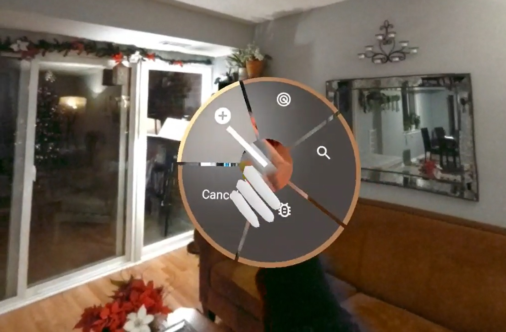
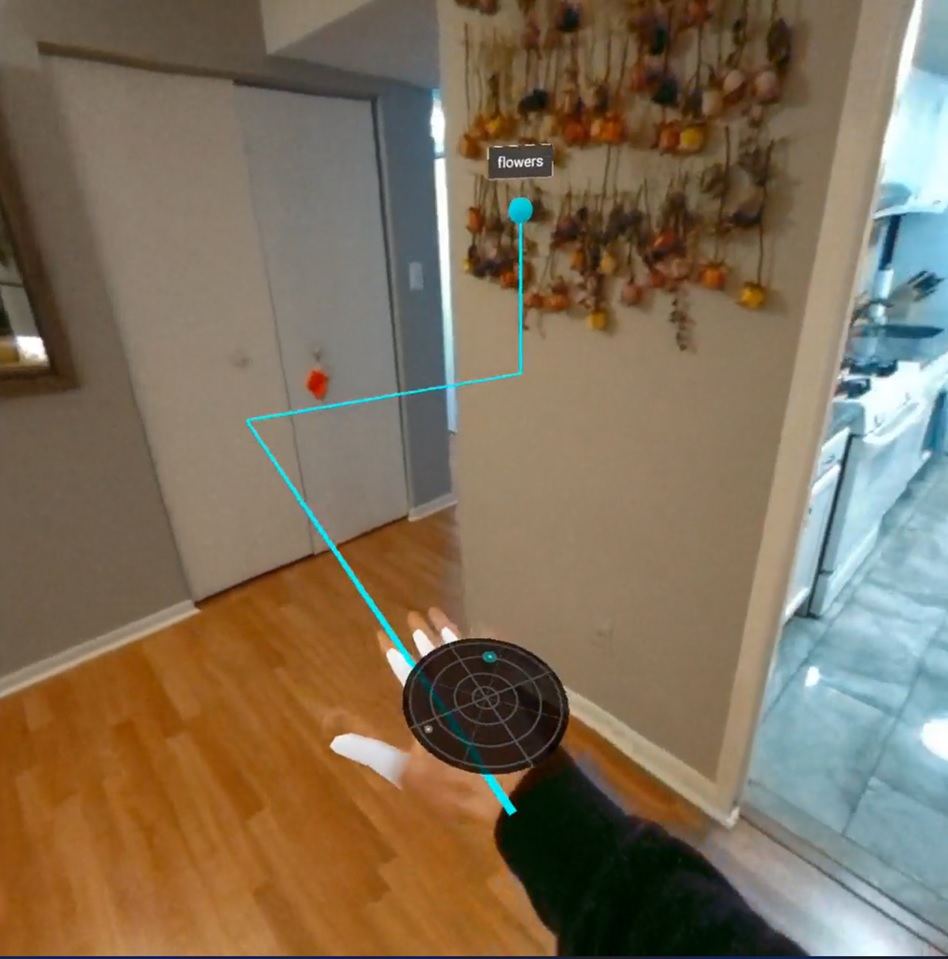
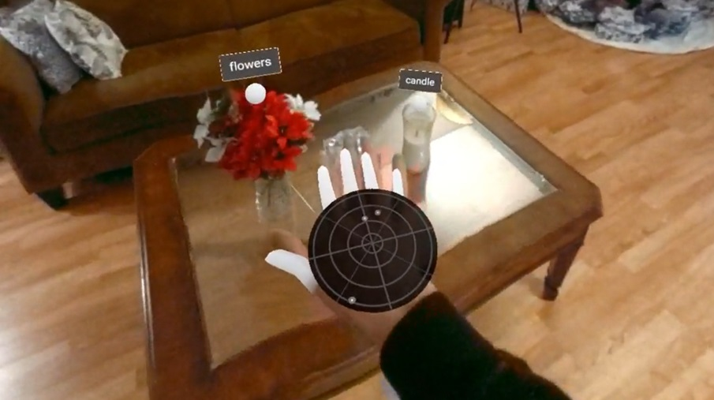
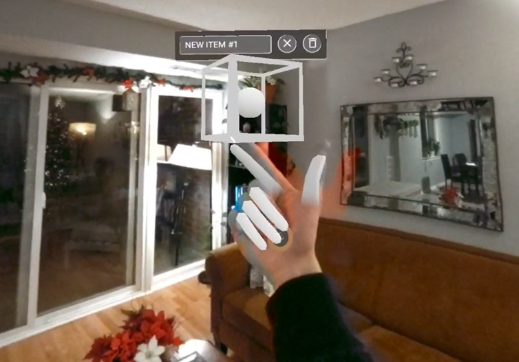

# AR Inventory
AR Inventory is an augmented reality inventory system that can be used to virtually label real-world locations. Users can then search and navigate to these labels. 

The system takes advantage of the Meta Quest’s spatial anchoring system to ensure that the inventory items are consistently word-locked to real-world locations across distinct user sessions. No calibration step is needed. The application is built with Microsoft’s StereoKit – a mixed reality library in C#. This application could be used in industrial settings wherever many items need to be spatially inventoried, such as a warehouse or library.

GitHub: https://github.com/jackdaus/AR-Inventory

<iframe width="384" height="256" src="https://www.youtube.com/embed/_x93WXU-CRo" title="AR Inventory - GMU CS 452 - Fall 2022 (WIP)" frameborder="0" allow="accelerometer; autoplay; clipboard-write; encrypted-media; gyroscope; picture-in-picture; web-share" allowfullscreen></iframe>

